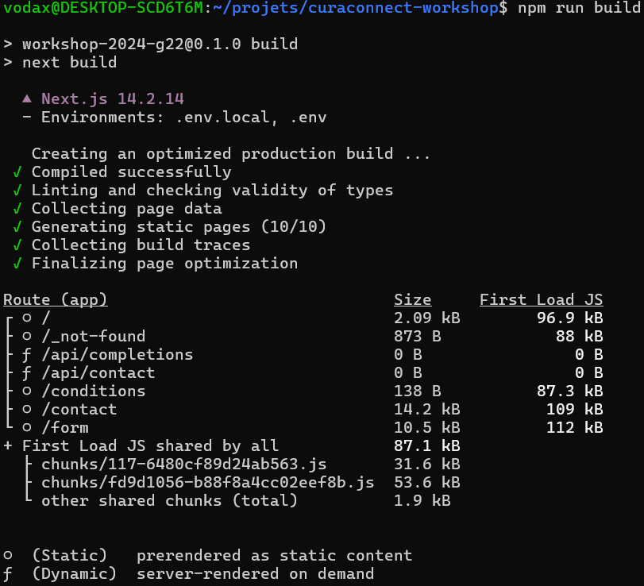
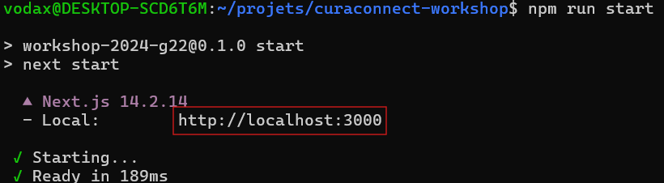
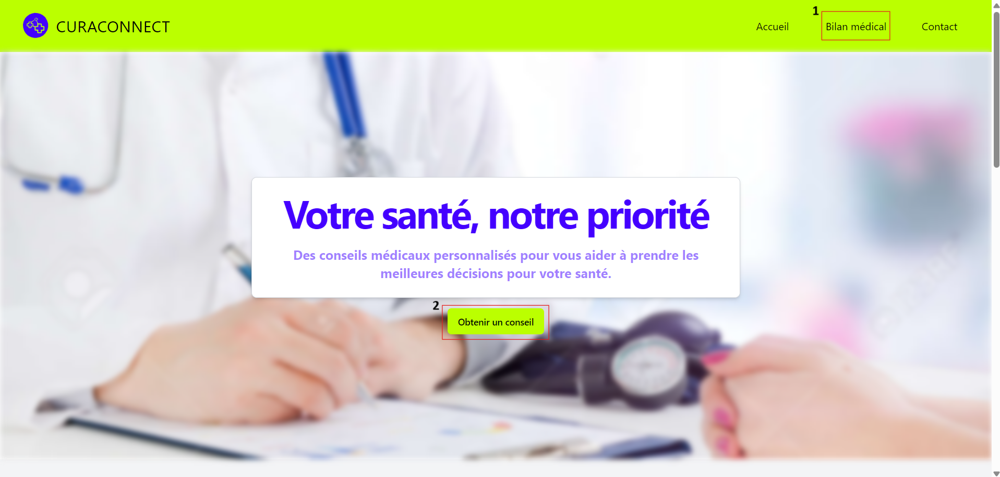
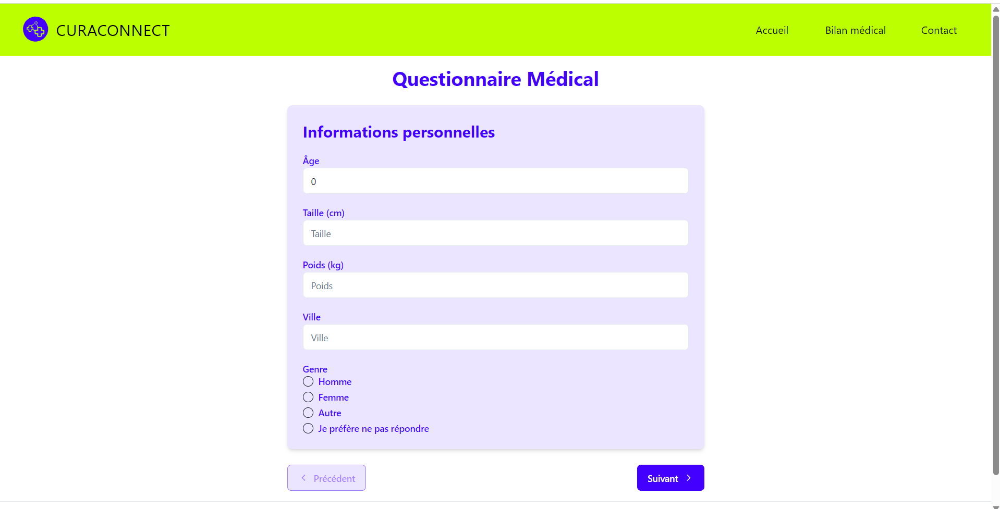
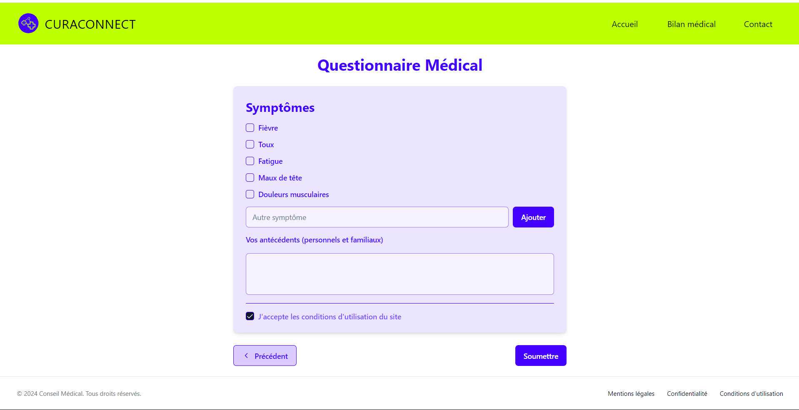
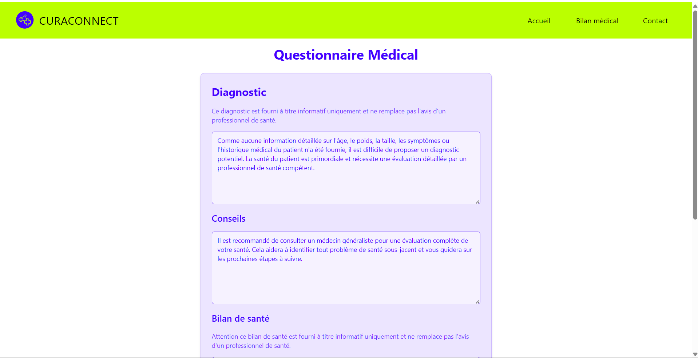
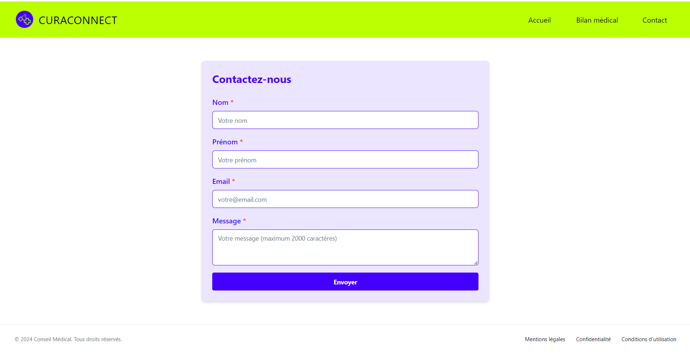

# CURACONNECT

## :pushpin: Table des matières
- [Description](#clipboard-description)
- [Installation et exécution de l'application](#hammer-installation-et-exécution-de-lapplication)
- [Utilisation de l'application](#computer-utilisation-de-lapplication)
- [Axes d'amélioration](#chart_with_upwards_trend-axes-damélioration)
- [Crédits](#handshake-crédits-5)
- [Licence](#memo-licence-6)

## :clipboard: Description
CuraConnect est une application de type SaaS de pré-diagnostic, de bilan de santé et de recommandation médicale améliorée par l'IA. Elle a été développée avec le framework NextJS pour les parties front-end et back-end, échangeant avec l'API d'OpenAI et son modèle d'intelligence artificielle gpt-4.0 turbo.

Cette application a été créée dans le cadre d'un workshop autour de l'e-santé organisé par l'école EPSI du 07 au 11 octobre 2024. 

Les fonctionnalités principales de l'application sont les suivantes :
- Remplissage d'un formulaire d'informations personnelles
- Génération d'un diagnostic, d'un bilan de santé et de conseils de santé
- Recommandation et préremplissage de recherches de practiciens sur Doctolib
- Formulaire de contact avec email de confirmation à la validation

## :hammer: Installation et exécution de l'application

Avant d'installer et d'exécuter l'application, assurez-vous d'avoir les outils nécessaires à l'exécution d'un projet nodeJS (l'application NodeJS doit donc être installée)

Une fois l'installation effectuée, clonez ce repository et installez toutes les dépendances avec la commande `npm install`

Ensuite, lancez la commande `npm run build` afin de préparer le projet à l'exécution du code.

Enfin, lancez la commande `npm run start` et vous pourrez accéder au projet à l'adresse indiquée dans l'encadrement rouge ci-dessous.

Pour l'utilisation de l'application, il est tout de même recommandé d'accéder directement au site hébergé en ligne à l'adresse suivante : https://curaconnect.vercel.app. Auquel cas les variables d'environnement ne seront pas fournies et certaines fonctionnalités seront indisponibles.

## :computer: Utilisation de l'application

Au lancement de l'application, vous pouvez accéder au questionnaire de santé soit par le lien dans la barre de navigation [1], soit par le bouton cliquable "Obtenir un conseil" [2]. 

Une fois la redirection effectuée, renseignez les champs de votre choix (ils sont tous optionnels) et passez à la page suivante.

Poursuivez le remplissage du formulaire, acceptez les conditions d'utilisation (lien cliquable) et soumettez votre questionnaire.

Après un certain délai, vous arriverez sur la dernière page du formulaire avec toutes les informations déduites par l'intelligence artificielle. Vous pouvez alors prendre connaissance des différentes recommandations de l'assistant médical et éventuellement prendre rendez-vous avec un des practiciens proposés par l'intelligence artificielle.

Vous avez également la page contact dans laquelle vous pourrez renseigner vos coordonnées et un message à adresser aux équipes de Curaconnect (pour des raisons de manque de temps et de protection des données, ces dernières ne sont pas stockées)

## :chart_with_upwards_trend: Axes d'amélioration

### Features :
- Améliorer l'accessibilité avec différents plugins facilitant la personnalisation du site
- Implémenter une sauvegarde des tentatives de contact en respectant la RGPD.
- Possibilité pour l'utilisateur de donner un retour sur l'expérience, qui pourra être utilisé pour des améliorations futures
- Implémentation d'un mode sombre ou plus contrasté
- Développement d'une IA souveraine propre au service

## :handshake: Crédits

- Nicolas Van-Duysen : Page de contact, implémentation de l'accessibilité, système de mailing, documentation
- Jeobran Kombou : Page de diagnostic (design / fonctionnel) 
- Aboubacar Nabe : Page d'accueil, mise en place de la route API, implémentation de l'IA
- Tom Saintenoy : Maquettage, page de formulaire (design / fonctionnel)  

## :memo: Licence

Ce projet est affilié à la [license MIT](./LICENCE)
